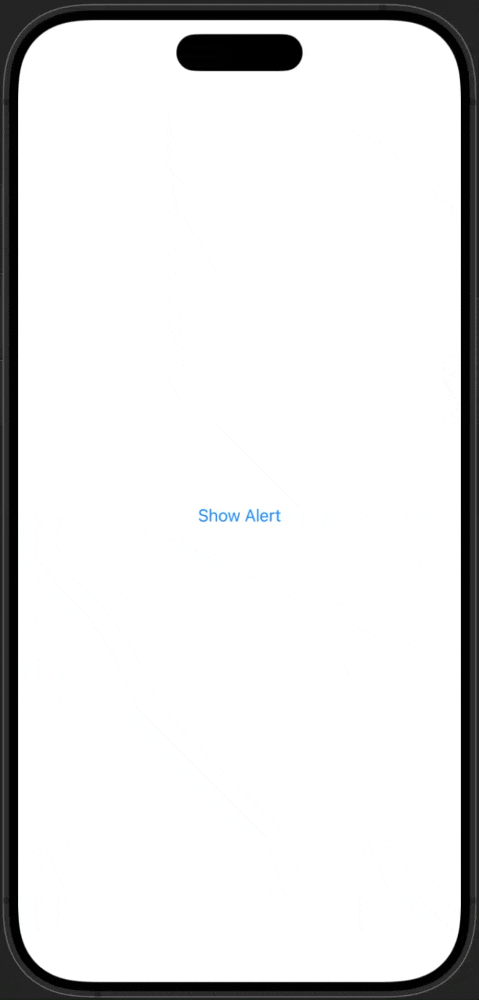
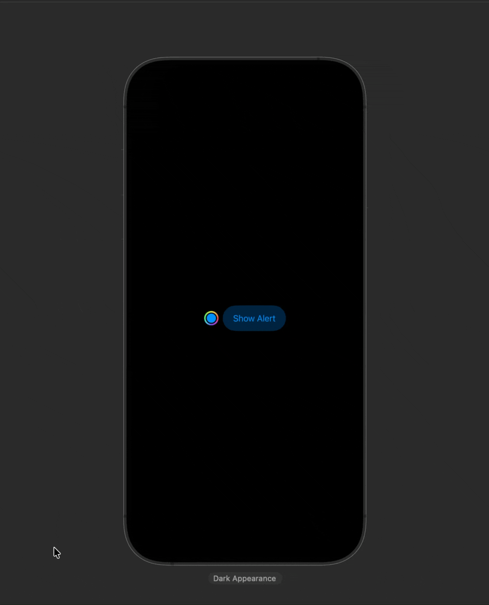

# Alert Advance

[](https://swift.org/)
[](https://swift.org/package-manager/)
[](LICENSE)
[](https://github.com/inekipelov/swiftui-alert-advance/actions/workflows/swift.yml)  
[](https://developer.apple.com/ios/)
[](https://developer.apple.com/mac-catalyst/)

Embed SwiftUI views inside `UIAlertController` alerts and action sheets with simple `alertContent` and `confirmationDialogContent` modifiers. Works on iOS/iPadOS 15+ and Mac Catalyst 15+.

## Highlights
- Custom SwiftUI content inside `UIAlertController`.
- Editing tint color for concrete `UIAlertController`.
- Drop-in modifiers – no need to rework existing alerts or confirmation dialogs.

## Preview
<table>
  <tr>
    <td align="center">Alert content</td>
    <td align="center">Confirmation dialog content</td>
  </tr>
  <tr>
    <td align="center">
      
    </td>
    <td align="center">
      
    </td>
  </tr>
</table>

## Usage

```swift
import SwiftUI
import AlertAdvance

struct ContentView: View {
    @State private var showAlert = false
    @State private var showSheet = false

    var body: some View {
        VStack(spacing: 16) {
            Button("Show alert") { showAlert = true }
                .alert("Title", isPresented: $showAlert) {
                    Button("OK") {}
                }
                .alertContent(isPresented: showAlert) {
                    VStack {
                        Text("Custom alert content")
                        ProgressView()
                    }
                    .padding()
                }

            Button("Show confirmation") { showSheet = true }
                .confirmationDialog("Title", isPresented: $showSheet) {
                    Button("Action") {}
                }
                .confirmationDialogContent(isPresented: showSheet) {
                    VStack {
                        Text("Custom sheet content")
                        Image(systemName: "hand.thumbsup.fill")
                    }
                    .padding()
                }
        }
        .padding()
    }
}
```
## Installation

Add via Swift Package Manager:

```swift
dependencies: [
    .package(url: "https://github.com/inekipelov/swiftui-alert-advance.git", from: "0.2.0")
],
targets: [
    .target(
        name: "YourTarget",
        dependencies: [
            .product(name: "AlertAdvance", package: "swiftui-alert-advance")
        ]
    )
]
```
