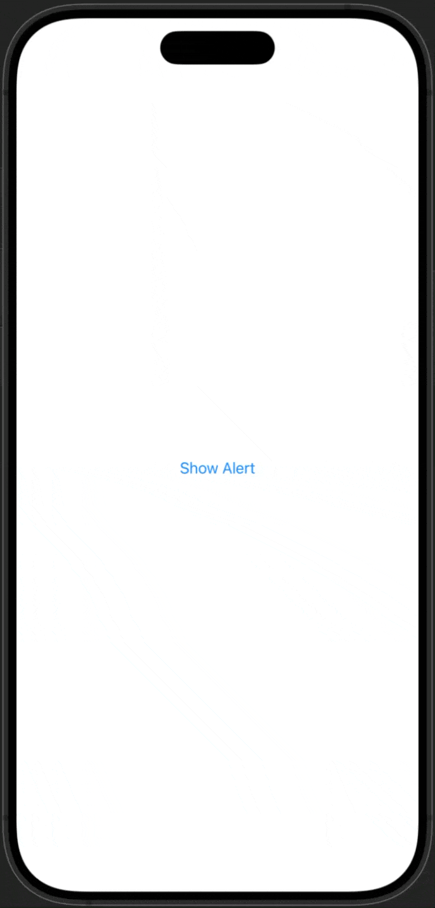
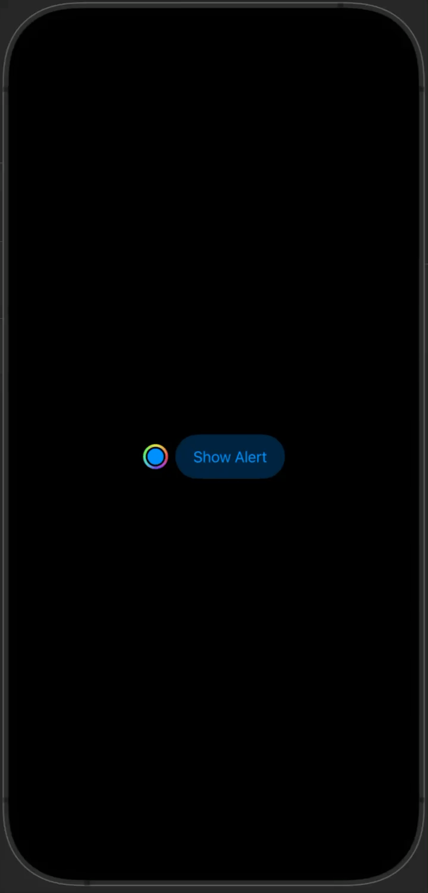

# Alert Advance

[](https://swift.org/)
[](https://developer.apple.com/ios/)
[](https://developer.apple.com/macos/)
[](https://developer.apple.com/mac-catalyst/)  
[](https://github.com/inekipelov/swiftui-alert-advance/actions/workflows/test.yml)

Embed SwiftUI views inside `UIAlertController` alerts and action sheets with simple `alertContent` and `confirmationDialogContent` modifiers. Requires Swift 6 and works on iOS/iPadOS 13+, macOS 10.15+ for package compatibility, and Mac Catalyst 13+. `confirmationDialogContent` remains available from iOS 15+ and Mac Catalyst 15+ because it builds on SwiftUI `confirmationDialog`.

## Highlights
- Custom SwiftUI content inside `UIAlertController`.
- Editing tint color for concrete `UIAlertController`.
- Alert/sheet dynamically re-measures and resizes when your SwiftUI content changes (e.g., toggles, sliders, collapsible views).
- Drop-in modifiers – no need to rework existing alerts or confirmation dialogs.

## Preview
<table>
  <tr>
    <td align="center">Alert content</td>
    <td align="center">Confirmation dialog content</td>
  </tr>
  <tr>
    <td align="center">
      
    </td>
    <td align="center">
      
    </td>
  </tr>
</table>

## Usage

```swift
import SwiftUI
import AlertAdvance

struct ContentView: View {
    @State private var isAlertPresented = false
    @State private var isDialogPresented = false
    @State private var selectedColor: Color = .blue
    @State private var sliderValue: Double = 0
    @State private var isDoneEnabled: Bool = false
    @State private var alertTextFieldText: String = ""
    @State private var date: Date = .now

    var body: some View {
        VStack(spacing: 20) {
            ColorPicker("Tint", selection: $selectedColor)
                .labelsHidden()

            Button("Show alert") { isAlertPresented = true }
                .alert("SwiftUI", isPresented: $isAlertPresented, actions: {
                    Button("Done") {}
                        .keyboardShortcut(.defaultAction)
                        .disabled(!isDoneEnabled)
                    Button("Close", role: .cancel) {}
                    TextField("Field", text: $alertTextFieldText)
                }, message: {
                    Text("Demo Alert Advance")
                })
                .alertContent(isPresented: isAlertPresented, tint: selectedColor) {
                    VStack {
                        DatePicker("Date", selection: $date, displayedComponents: .date)
                            .datePickerStyle(.graphical)
                        Slider(value: $sliderValue, in: 0...100)
                        Toggle("Enable Done", isOn: $isDoneEnabled)
                            .tint(selectedColor)
                    }
                    .padding(.horizontal)
                }

            Button("Show confirmation") { isDialogPresented = true }
                .confirmationDialog("SwiftUI", isPresented: $isDialogPresented, titleVisibility: .visible, actions: {
                    Button("Done") {}
                        .keyboardShortcut(.defaultAction)
                    Button("Close", role: .cancel) {}
                }, message: {
                    Text("Demo Alert Advance")
                })
                .confirmationDialogContent(isPresented: isDialogPresented, tint: selectedColor) {
                    VStack {
                        DatePicker("Date", selection: $date, displayedComponents: .date)
                            .datePickerStyle(.compact)
                        Slider(value: $sliderValue, in: 0...100)
                    }
                    .padding(.horizontal)
                }
        }
        .padding()
    }
}
```
## Installation

Add via Swift Package Manager:

```swift
dependencies: [
    .package(url: "https://github.com/inekipelov/swiftui-alert-advance.git", from: "0.3.0")
],
targets: [
    .target(
        name: "YourTarget",
        dependencies: [
            .product(name: "AlertAdvance", package: "swiftui-alert-advance")
        ]
    )
]
```
